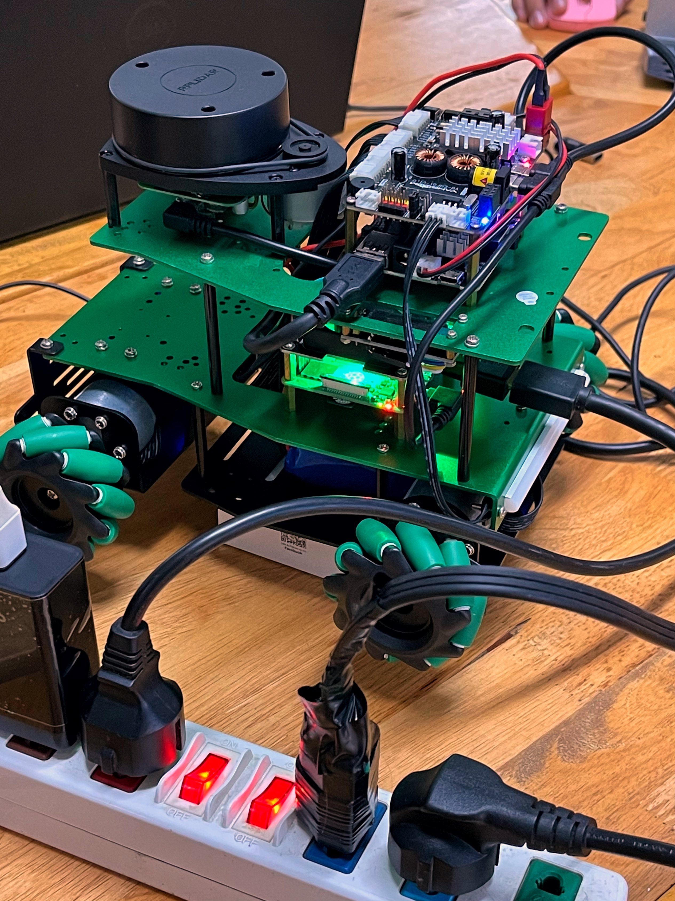
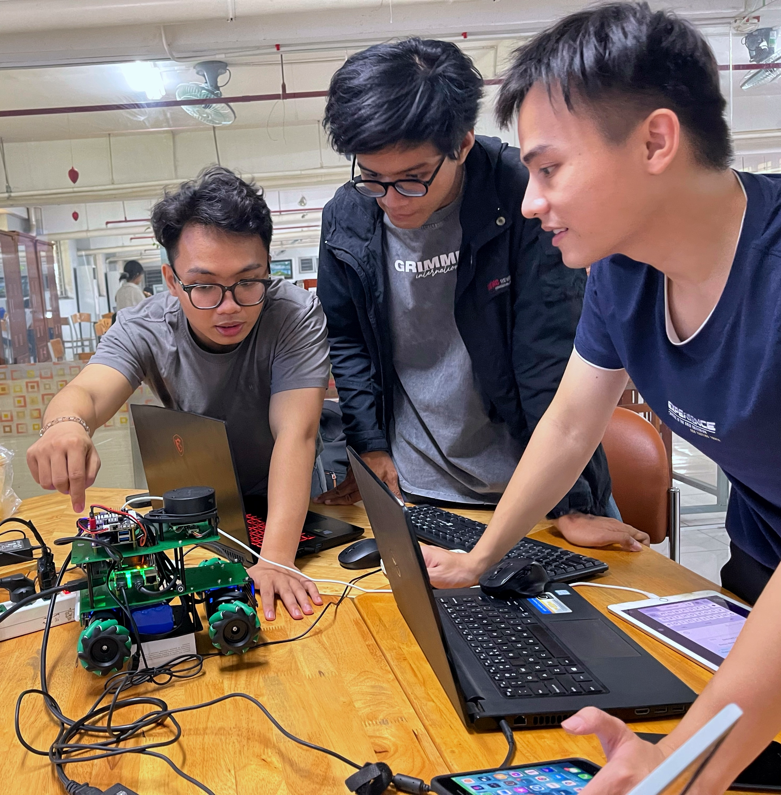
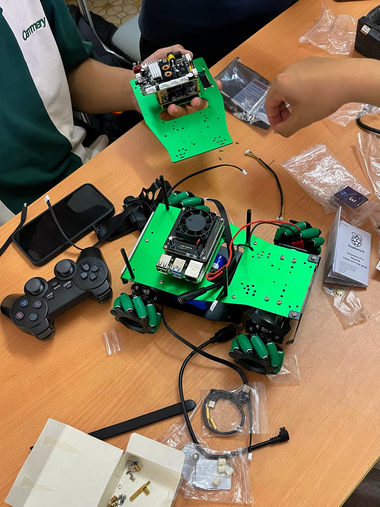
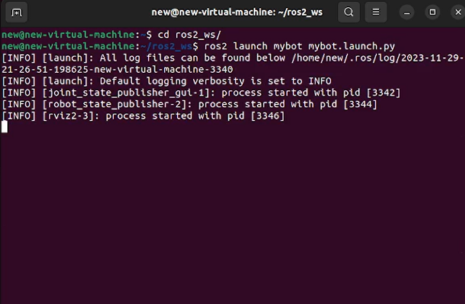
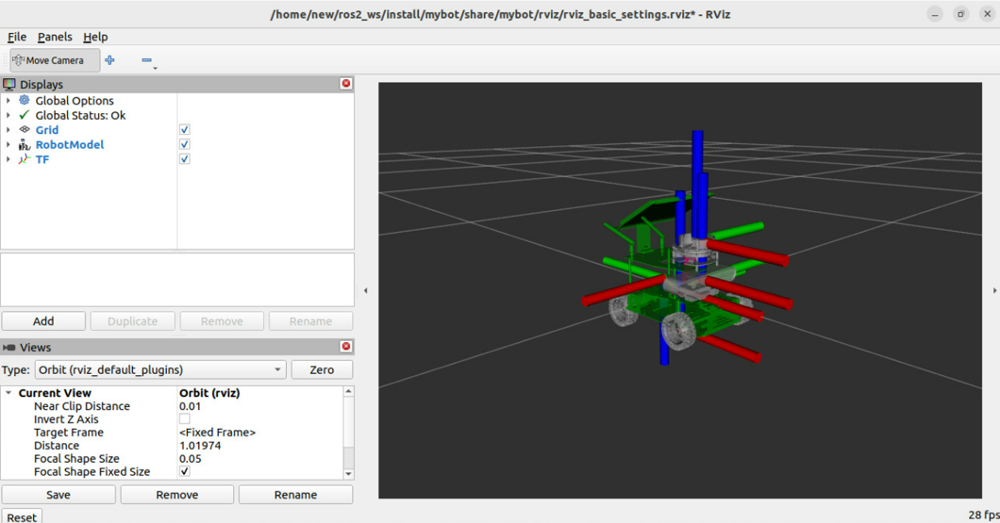
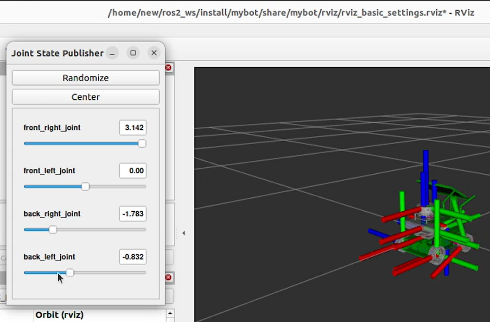

# Rosmaster X3 Raspberry Pi 4B Autonomous Car
A ROS 2-based autonomous vehicle project built around the ROSMASTER X3 platform, Raspberry Pi 4B, and YDLIDAR X3, combining physical robot assembly with custom robot modeling and RViz-based simulation.

<p align="center">
  <br>
  <em>Figure 1. Completed ROSMASTER X3 platform assembled for the project physical implementation and development.</em>
</p>

## Overview

This project was developed as a group project for the Automotive Electrical and Electronic Systems course at Ho Chi Minh City University of Technology and Education (HCMUTE) during the 2023–2024 academic year.

The project explored an autonomous-car platform built around the ROSMASTER X3, with a Raspberry Pi 4B as the main computing platform and a YDLIDAR X3 as a key sensing component. The group assembled and worked with the physical robot platform, while also developing a ROS 2 robot description and visualization environment for simulation.

The custom ROS 2 package includes a robot model with four mecanum wheels, LiDAR and camera representations, URDF-based robot description, launch configuration, and RViz visualization. The project was demonstrated through both the physical robot platform and a ROS 2/RViz simulation workflow.

## Project Objectives

The project aimed to:

- Explore the architecture and operation of the ROSMASTER X3 autonomous vehicle platform.
- Assemble and work with the physical robot platform and its main hardware components.
- Develop a ROS 2 robot description representing the four-wheel mecanum vehicle and onboard sensor locations.
- Configure a visualization workflow using URDF, robot state publishing, joint state control, and RViz.
- Demonstrate the relationship between the physical robot platform and its ROS 2 simulation model.

## Development Process

The project combined physical robot assembly with software development and ROS 2 simulation. The team worked together to assemble the ROSMASTER X3 platform, configure its hardware, and develop the corresponding robot model and visualization workflow.

<p align="center">
  <br>
  <em>Figure 2. Team members working together during the physical assembly and development of the ROSMASTER X3 platform.</em>
</p>

## Hardware Platform

The physical platform used in the project was the ROSMASTER X3, a mecanum-wheel mobile robot equipped with a Raspberry Pi 4B computing platform and a YDLIDAR X3 sensor. The project documentation identifies the X3 LiDAR, Raspberry Pi 4B, and expansion board as the main components of the platform. :contentReference[oaicite:0]{index=0}

The ROSMASTER X3 uses four mecanum wheels, allowing the robot to move in multiple directions. The Raspberry Pi 4B serves as the main onboard computing platform, while the YDLIDAR X3 provides LiDAR sensing for the robot system. The hardware platform also includes an expansion board and the supporting mechanical and electrical components required to assemble the robot. :contentReference[oaicite:1]{index=1}

<p align="center">
  <br>
  <em>Figure 3. Physical assembly of the ROSMASTER X3 platform and its main components.</em>
</p>

## ROS 2 Robot Model

To support the simulation and visualization workflow, the project includes a custom ROS 2 package named `mybot`. The package contains a URDF-based robot description representing the four mecanum wheels, the LiDAR and camera mounting locations, and the corresponding robot geometry.

The robot description defines the chassis, four continuous wheel joints, an IMU link, a LiDAR link, and a camera link. The geometry is connected through the corresponding mesh files in the `meshes` directory. :contentReference[oaicite:2]{index=2} :contentReference[oaicite:3]{index=3} :contentReference[oaicite:4]{index=4}

The package also includes a ROS 2 launch file that loads the robot description, starts the joint-state and robot-state publishers, and launches RViz for visualization. :contentReference[oaicite:5]{index=5} :contentReference[oaicite:6]{index=6}

<p align="center">
  <br>
  <em>Figure 4. ROS 2 launch process initializing the custom robot description, state publishers, and RViz.</em>
</p>

## Simulation and Visualization

The simulation workflow uses RViz to visualize the robot model and its coordinate frames. The RViz configuration enables the RobotModel, TF, and Grid displays, with `base_link` used as the fixed reference frame. :contentReference[oaicite:7]{index=7}

<p align="center">
  <br>
  <em>Figure 5. RViz visualization of the four-wheel mecanum robot model and coordinate frames.</em>
</p>

The robot joints can also be adjusted interactively through the Joint State Publisher interface. In the simulation demonstration, the four wheel joints are individually exposed for manual adjustment:

- `front_right_joint`
- `front_left_joint`
- `back_right_joint`
- `back_left_joint`

<p align="center">
  <br>
  <em>Figure 6. Joint State Publisher interface used to interactively control the four wheel joints.</em>
</p>

## Project Contribution

The project combined an off-the-shelf ROSMASTER X3 robotic platform with a custom ROS 2 robot description and visualization package.

The main project-specific work presented in this repository includes:

- Building the physical ROSMASTER X3 platform with its mecanum-wheel configuration.
- Creating the `mybot` ROS 2 package for the robot model.
- Defining the robot structure, wheel joints, and sensor mounting locations in URDF.
- Preparing the corresponding mesh assets for the robot body and sensors.
- Configuring ROS 2 launch, robot-state publishing, and RViz visualization.
- Demonstrating interactive joint control of the four mecanum wheels.

The repository intentionally excludes the original vendor workspace and third-party ROS packages used as the underlying platform software.

## Physical Robot Demonstration

The project also included work with the physical ROSMASTER X3 platform and its onboard YDLIDAR X3 sensor.

The following video shows the assembled robot from above while the LiDAR operates continuously. The vehicle remains stationary in this demonstration.

[Watch the physical robot and LiDAR demonstration](./media/real_robot_lidar_demo.mp4)

## Simulation Demonstration

The simulation workflow was demonstrated by launching the custom `mybot` ROS 2 package, opening the RViz environment, and interacting with the four wheel joints through the Joint State Publisher interface.

The demonstration shows the robot model being loaded into the 3D visualization environment and the following wheel joints being adjusted individually:

- `front_right_joint`
- `front_left_joint`
- `back_right_joint`
- `back_left_joint`

[Watch the ROS 2 simulation demonstration](./media/simulation_demo.mp4)

## Repository Structure

```text
RosmasterX3-RaspberryPi4B-Autonomous-Car/
├── mybot/
│   ├── launch/
│   │   └── mybot.launch.py
│   ├── meshes/
│   │   ├── mecanum/
│   │   │   ├── back_left_wheel.STL
│   │   │   ├── back_right_wheel.STL
│   │   │   ├── base_link.STL
│   │   │   ├── front_left_wheel.STL
│   │   │   └── front_right_wheel.STL
│   │   └── sensor/
│   │       ├── camera_link.STL
│   │       └── laser_link.STL
│   ├── rviz/
│   │   └── rviz_basic_settings.rviz
│   ├── urdf/
│   │   └── mybot.urdf
│   ├── CMakeLists.txt
│   └── package.xml
├── media/
│   ├── real_robot_lidar_demo.mp4
│   └── simulation_demo.mp4
├── report/
│   ├── RosmasterX3_Project_Document.pdf
│   └── RosmasterX3_Project_Presentation.pdf
└── README.md
```
